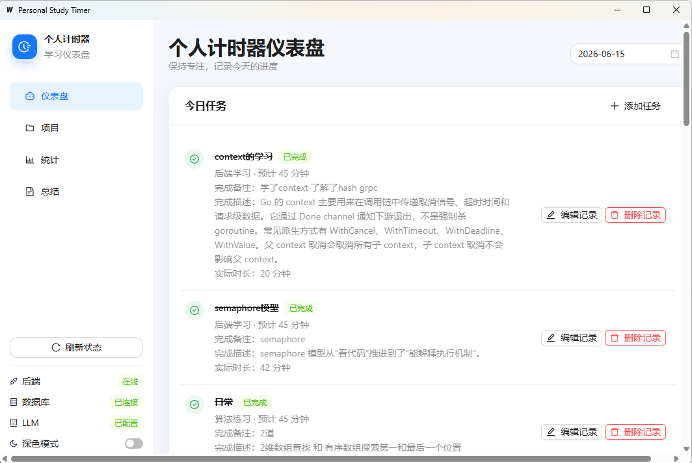

# Personal Study Timer

Personal Study Timer 是一个使用 **Go + MySQL + Wails** 开发的个人学习计时桌面应用。项目围绕“项目分类、每日任务、计时记录、统计与 AI 总结”组织，适合用于展示桌面应用开发、前后端协作、事务处理和统计查询等工程实践。

## 核心功能

- 项目管理：创建、编辑和删除长期学习项目。
- 每日任务管理：按日期创建并查看学习任务。
- 任务计时：支持开始、暂停、继续和完成任务。
- 完成记录：完成任务时必须填写完成备注和完成描述。
- 完成后编辑：可修改已完成任务的备注、描述和实际时长。
- 完成任务删除：仅允许删除已完成任务，并清理关联计时会话。
- 学习统计：提供日统计和周统计。
- AI 总结：通过 LLM API 生成每日总结和每周总结。
- Windows 一键启动：自动检查环境、执行前端检查并启动开发环境。

## 项目截图

### 项目界面总览

界面展示了每日任务、计时状态、统计信息和 AI 总结入口。



## 技术栈

| 层级 | 技术 |
| --- | --- |
| 后端 | Go、Gin |
| 数据库 | MySQL |
| 桌面应用 | Wails |
| 前端 | React、TypeScript、Vite、Ant Design |
| AI 能力 | LLM API |

## 系统结构

```text
Wails Desktop
├── React / TypeScript UI
├── Wails Go bindings
└── HTTP client
        │
        ▼
Gin API Server
├── projects
├── daily tasks / timer
├── stats
└── summaries / LLM
        │
        ▼
      MySQL
```

桌面端通过 Wails 提供原生窗口与 Go bindings，并调用独立运行的 Gin 后端。后端负责业务校验、事务处理、统计聚合和 LLM 调用；MySQL 保存项目、任务、计时会话与总结数据。

## 核心数据设计

| 数据表 | 作用 |
| --- | --- |
| `projects` | 长期学习项目或任务分类。删除项目时保留历史任务，并将任务的项目关联置空。 |
| `daily_tasks` | 某一天需要执行的具体任务，保存预计时长、状态和完成记录。 |
| `time_sessions` | 记录任务每次开始至暂停或完成之间的计时区间。 |
| `generated_summaries` | 保存 AI 生成的每日或每周总结，以及生成时使用的源数据。 |

`daily_tasks` 中与完成记录相关的字段：

- `finish_note`：任务完成时填写的简短备注。
- `finish_description`：任务完成时填写的详细描述。
- `completed_at`：任务完成时间。
- `actual_seconds_override`：人工修正后的实际时长，单位为秒。为 `NULL` 时使用 `time_sessions` 聚合时长；有值时，日统计、周统计和 AI 总结优先使用该值。

## 任务状态流转

后端保存的任务状态保持为英文枚举，前端只负责显示中文标签。

```text
planned ──开始──> running ──暂停──> paused
                    │                 │
                    └────完成─────────┤
                                      └──继续──> running

running / paused ──完成──> completed
planned <────────取消 / 恢复────────> cancelled
```

- `planned`：计划中，可以开始或取消。
- `running`：进行中，可以暂停或完成。
- `paused`：已暂停，可以继续或完成。
- `completed`：已完成，可以编辑完成记录或删除记录。
- `cancelled`：已取消，可以恢复为计划中。

完成任务时，后端会校验备注和描述非空，并在事务中结束当前计时会话、更新任务状态和保存完成记录。

## 项目亮点

- **计时会话建模**：通过 `time_sessions` 保存多次开始、暂停和继续产生的时间区间，避免只依赖前端计时状态。
- **可覆盖的实际时长**：使用 `actual_seconds_override` 支持人工修正，同时保留恢复为会话聚合时长的能力。
- **一致的统计口径**：日统计、周统计与 AI 总结输入统一优先使用人工修正时长。
- **事务化完成与删除**：完成任务和删除完成记录时同步处理任务与关联会话，降低数据不一致风险。
- **前后端职责分离**：Wails 桌面端负责交互和展示，Gin 后端集中处理业务规则与数据访问。
- **可诊断的开发启动脚本**：Windows 脚本检查必要环境，限制前端构建等待时间，并输出明确失败原因。

## 本地开发

### 环境要求

- Go
- MySQL
- Node.js 与 npm
- Wails CLI
- 项目根目录下的 `.env`

启动脚本不会自动启动 MySQL。运行应用前，请先确保 MySQL 已启动且 `.env` 配置正确。

### 推荐：Windows 双击或命令行启动

在项目根目录双击：

```text
start-desktop-dev.bat
```

或在 PowerShell 中运行：

```powershell
.\start-desktop-dev.bat
```

脚本会检查必要目录和命令，仅在缺少 `node_modules` 时安装依赖，执行 TypeScript 与前端构建检查，然后启动后端和 `wails dev`。

### PowerShell 启动

可以从任意路径运行：

```powershell
powershell -NoProfile -ExecutionPolicy Bypass -File E:\Projects\personal-study-timer\scripts\start-desktop-dev.ps1
```

### 手动启动

先启动后端：

```powershell
cd E:\Projects\personal-study-timer\backend-go
go run ./cmd/server
```

再打开另一个 PowerShell 窗口启动桌面端：

```powershell
cd E:\Projects\personal-study-timer\desktop-wails
wails dev
```

## 测试与检查

后端测试：

```powershell
cd E:\Projects\personal-study-timer\backend-go
go test ./...
```

桌面端 Go 测试：

```powershell
cd E:\Projects\personal-study-timer\desktop-wails
go test ./...
```

前端 TypeScript 检查与构建：

```powershell
cd E:\Projects\personal-study-timer\desktop-wails\frontend
npx tsc --noEmit
npm run build
```

构建产物目录 `desktop-wails/frontend/dist/` 已加入 `.gitignore`，不应提交到仓库。

## 目录结构

```text
personal-study-timer/
├── backend-go/                 # Gin API、业务服务、数据访问与 migrations
├── desktop-wails/              # Wails 桌面端与 React 前端
├── docs/images/                # README 项目截图
├── scripts/start-desktop-dev.ps1
├── start-desktop-dev.bat
└── README.md
```

## Roadmap

- 增加关键业务流程的集成测试覆盖。
- 补充数据库迁移执行与回滚说明。
- 优化开发环境诊断信息和日志展示。
- 持续改善桌面端可访问性与键盘操作体验。
