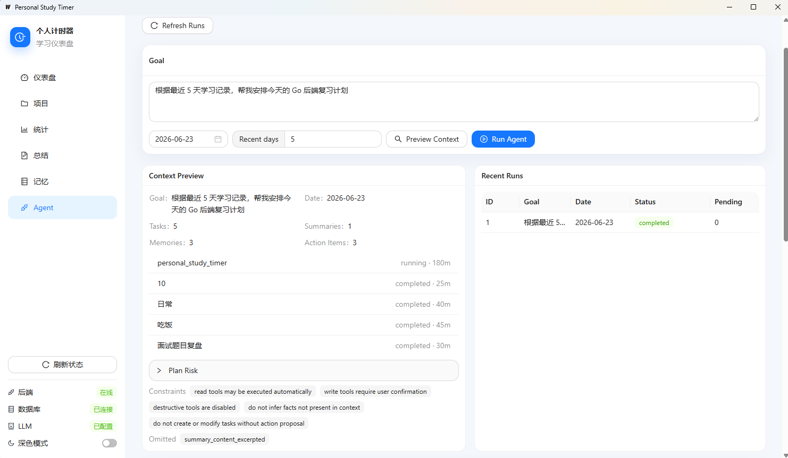
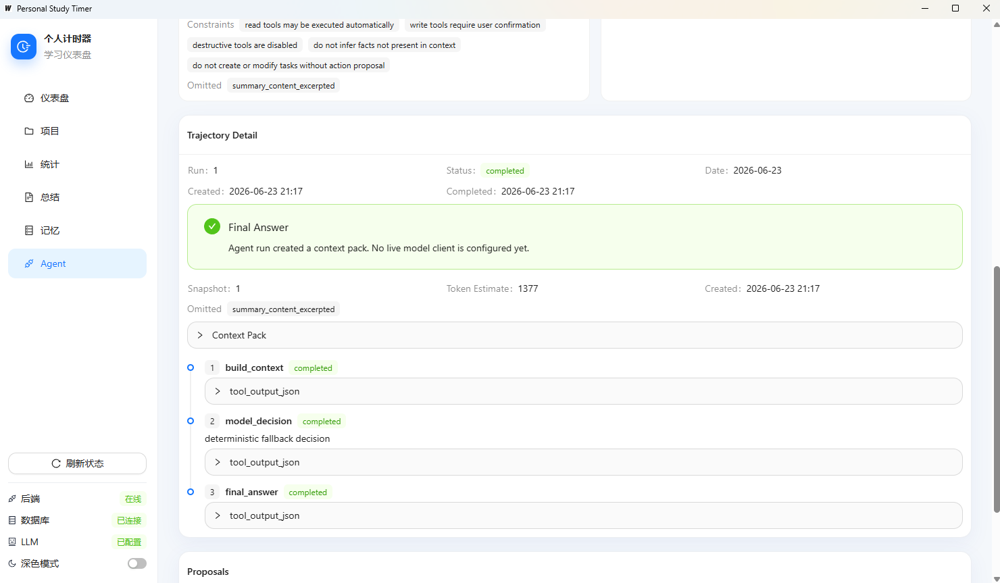
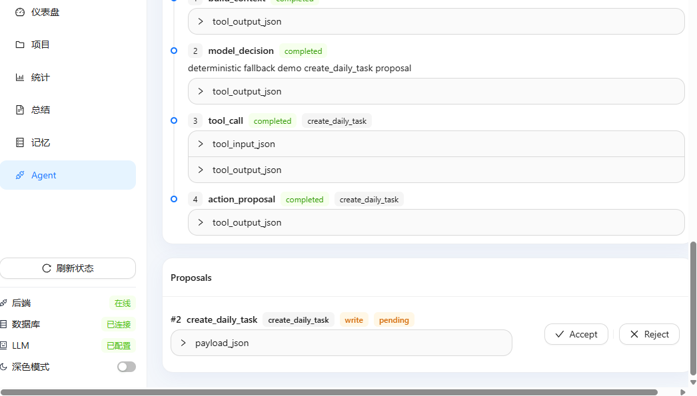
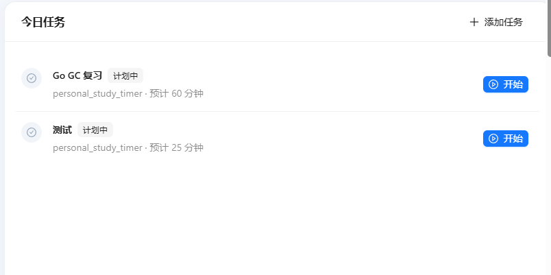
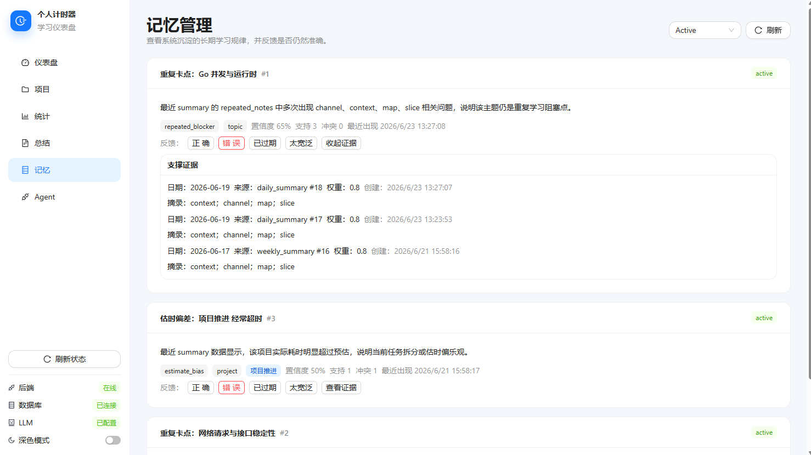

# Personal Agent Harness Workbench

Go + Wails + MySQL + LLM Agent Harness

Personal Study Timer is a local desktop workbench for structured study planning, time tracking, memory, feedback, and agent-harness experiments. It started as a study timer, but the current focus is the engineering layer around an LLM-style agent: controlled context, tool execution, human approval for writes, trajectory logs, and evaluation.

## Why This Is Not Just A Timer

A normal timer records elapsed time. This project records the learning loop:

- planned tasks and estimated minutes
- real focus sessions and completion notes
- estimate bias and plan-risk signals
- daily / weekly summaries
- action items and acceptance tracking
- long-term memories linked to evidence
- human feedback on summaries, action items, and memories
- agent runs, steps, context snapshots, action proposals, and replay/eval checks

The system keeps deterministic rules and MySQL state as the source of truth. LLM output is treated as text generation or model decision input, not as an unrestricted writer.

## Agent Harness Architecture

The Agent Harness is the layer outside the model:

```text
User Goal
  -> Context Pack Builder
  -> ModelClient decision interface
  -> Tool Registry
  -> Permission Guard
  -> Action Proposal
  -> Trajectory Log
  -> Replay / Evaluation
```

Key rule: read tools may execute automatically; write tools create proposals; only user acceptance executes real business services.

## Completed Capabilities

- Daily task planning, timer sessions, pause/resume/finish flows.
- Daily and weekly stats.
- Daily and weekly summary generation.
- Estimate preview and plan-risk analysis.
- Study memories with evidence.
- Feedback foundation for summaries, action items, and memories.
- Action item acceptance tracking.
- Agent Tool Registry, Context Pack, Run Loop, Permission Guard, Trajectory Log, Console UI, and Evaluation / Replay V1.

## Tech Stack

| Layer | Stack |
| --- | --- |
| Backend | Go, Gin |
| Database | MySQL |
| Desktop | Wails |
| Frontend | React, TypeScript, Vite, Ant Design |
| Agent Harness | Go package under `backend-go/internal/agent` |
| LLM boundary | `ModelClient` interface, deterministic fallback in tests/dev |

## Core Modules

- `backend-go/internal/dailytasks`: planned tasks and completion records.
- `backend-go/internal/timer`: start, pause, resume, finish.
- `backend-go/internal/summaries`: daily / weekly generated summaries and action items.
- `backend-go/internal/memories`: long-term study memories and evidence.
- `backend-go/internal/feedback`: structured human feedback.
- `backend-go/internal/agent`: harness types, tools, context pack, runner, proposals, trajectory, eval.
- `desktop-wails/frontend/src/AgentPage.tsx`: minimal Agent Console.

## Data Feedback Loop

```text
task plan
  -> timer sessions
  -> completion notes and actual minutes
  -> summary and action items
  -> action item acceptance
  -> memory / evidence / feedback
  -> context pack
  -> agent proposal
  -> user accept / reject
  -> evaluation and replay
```

This loop makes the agent behavior inspectable. A proposal can be traced back to context, tool calls, memory evidence, and user decisions.

## Agent Phase Summary

- Phase 0: Agent Harness design and base types.
- Phase A: Tool Registry with read/write risk levels.
- Phase B: Context Pack Preview with truncation and `omitted_sections`.
- Phase C: Agent Run / Loop V1 with `ModelClient`.
- Phase D: Persistent Action Proposal and Permission Guard.
- Phase E: Trajectory Log and Context Snapshot.
- Phase F: Agent Console UI in Wails.
- Phase G: Evaluation / Replay V1 without real LLM dependency.
- Phase H: README, screenshots guide, interview notes, and resume packaging.

## API Overview

Core APIs:

- `GET /api/daily-tasks`
- `POST /api/daily-tasks`
- `POST /api/daily-tasks/:id/start`
- `POST /api/daily-tasks/:id/pause`
- `POST /api/daily-tasks/:id/resume`
- `POST /api/daily-tasks/:id/finish`
- `GET /api/stats/daily`
- `GET /api/stats/weekly`
- `POST /api/summaries/daily/generate`
- `POST /api/summaries/weekly/generate`
- `GET /api/memories`
- `GET /api/memories/:id/evidence`
- `POST /api/feedback`

Agent APIs:

- `GET /api/agent/tools`
- `POST /api/agent/tool-call`
- `POST /api/agent/context-preview`
- `POST /api/agent/runs`
- `GET /api/agent/runs`
- `GET /api/agent/runs/:id`
- `GET /api/agent/runs/:id/trajectory`
- `GET /api/agent/action-proposals`
- `GET /api/agent/action-proposals/:id`
- `POST /api/agent/action-proposals/:id/accept`
- `POST /api/agent/action-proposals/:id/reject`

## Database Migration Overview

- `001`-`004`: projects, daily tasks, time sessions, generated summaries.
- `005`-`008`: summary range uniqueness, completion fields, project scope, action items.
- `009`-`012`: study memories, memory evidence, feedback, action item acceptance tracking.
- `013`: `agent_runs`.
- `014`: `agent_steps`.
- `015`: `agent_action_proposals`.
- `016`: `agent_context_snapshots`.

Run migrations manually against the local MySQL database before using features backed by new tables.

## Local Development

Backend:

```powershell
cd E:\Projects\personal-study-timer\backend-go
go run ./cmd/server
```

Desktop:

```powershell
cd E:\Projects\personal-study-timer\desktop-wails
wails dev
```

Frontend only:

```powershell
cd E:\Projects\personal-study-timer\desktop-wails\frontend
npm run dev
```

## Tests

Backend:

```powershell
cd E:\Projects\personal-study-timer\backend-go
go test ./...
```

Desktop Go:

```powershell
cd E:\Projects\personal-study-timer\desktop-wails
go test ./...
```

Frontend:

```powershell
cd E:\Projects\personal-study-timer\desktop-wails\frontend
npx tsc --noEmit
npm test
```

If Windows blocks Go temp/cache cleanup, use project-local cache:

```powershell
mkdir .gotmp, .gocache -Force
$env:GOTMPDIR="$PWD\.gotmp"
$env:GOCACHE="$PWD\.gocache"
go test -work ./...
```

## Demo Flow / Screenshots

### Context Pack Preview



Shows the ContextPack assembled before an agent run: today tasks, recent summaries, memories, constraints, and omitted sections. This demonstrates that the harness builds controlled context instead of passing the raw user prompt straight to a model.

### Agent Run Trajectory



Shows the run step timeline, including `build_context`, `model_decision`, `tool_call`, and final response steps. This makes agent behavior auditable after the run.

### Human-in-the-loop Action Proposal



Shows a `create_daily_task` write tool intercepted as a pending proposal with Accept / Reject controls. The agent can propose a business write, but it cannot write directly without user approval.

### Today Tasks



Shows a confirmed agent proposal entering the daily plan alongside normal study task management. This keeps agent output inside the same task workflow as manually created work.

### Evidence-linked Memory



Shows memory confidence, support count, evidence records, and user feedback controls. Long-term memory is tied to stored evidence instead of being treated as source-free model text.

## Interview Highlights

- Built a local desktop app with Go, Wails, React, and MySQL.
- Designed an Agent Harness without depending on LangChain or a vector database.
- Separated read tools from write tools with a human-in-the-loop proposal guard.
- Persisted context snapshots, tool steps, and action proposals for auditability.
- Added evidence-linked memory so long-term context is grounded in stored records.
- Added replay/eval checks for key behaviors such as write confirmation and idempotent accept.

## Current Boundaries

- No autonomous scheduling.
- No destructive agent tools.
- No arbitrary shell or file operations.
- No full chain-of-thought persistence.
- No vector database or RAG until there is a real large-document retrieval problem.
